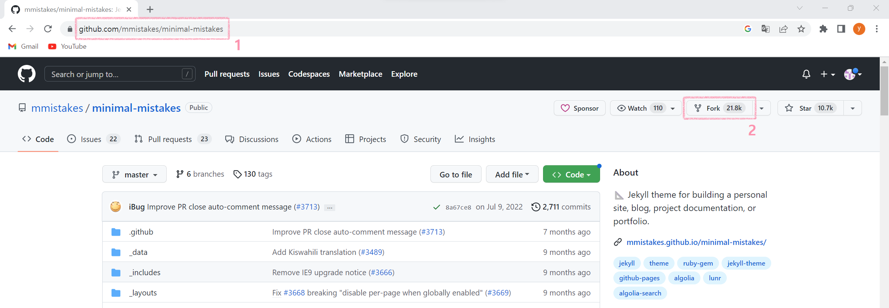
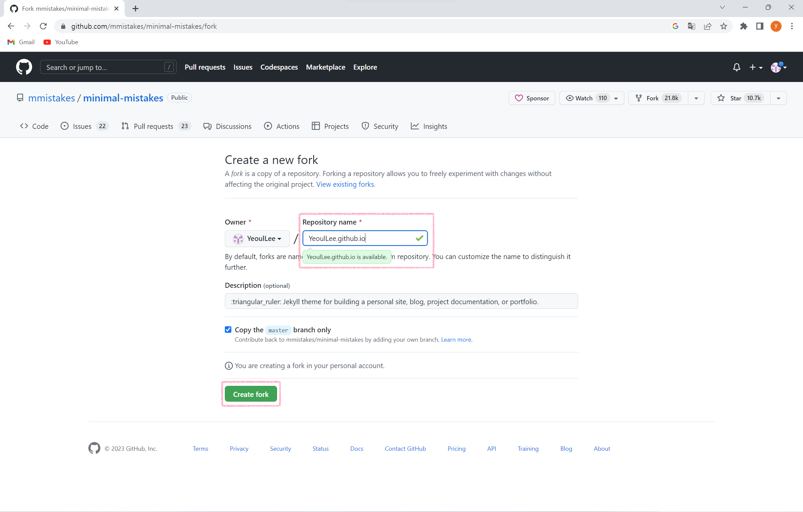
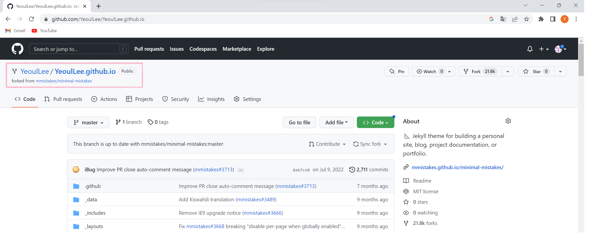
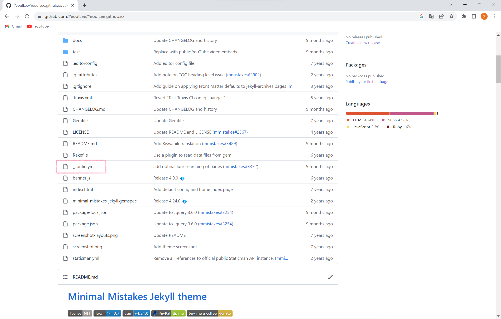
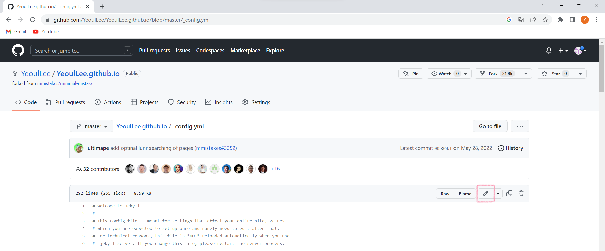
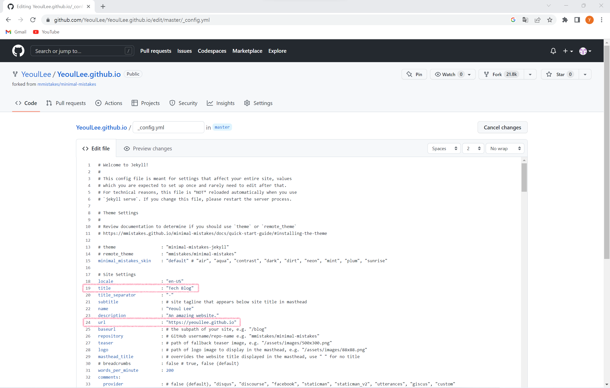
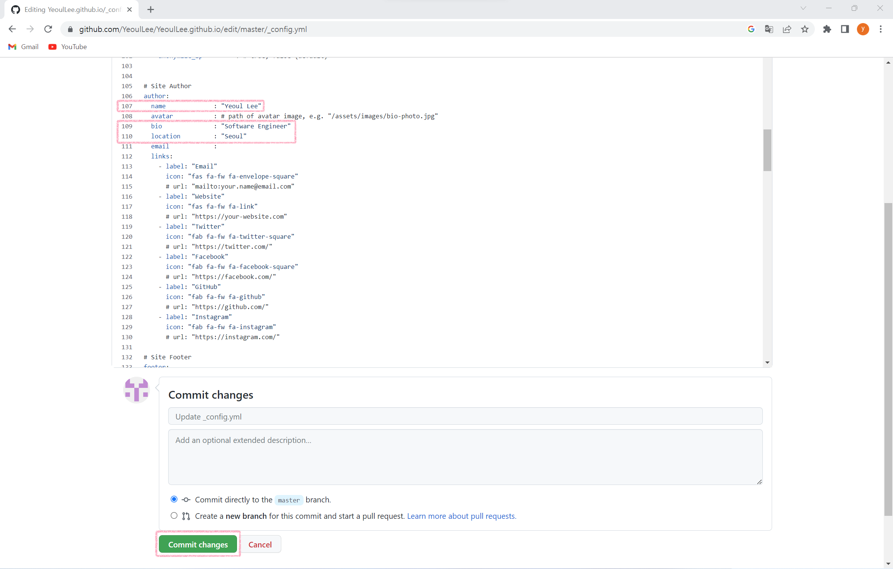
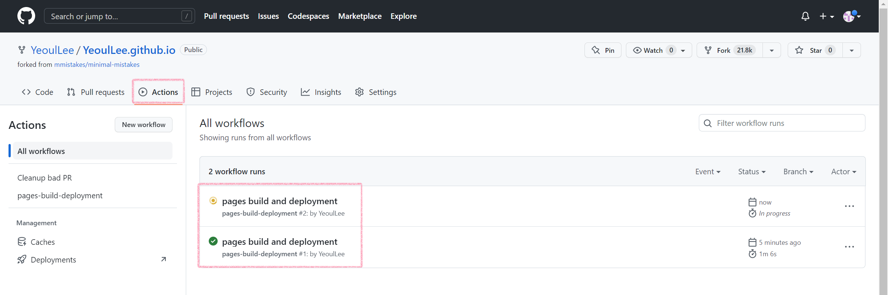
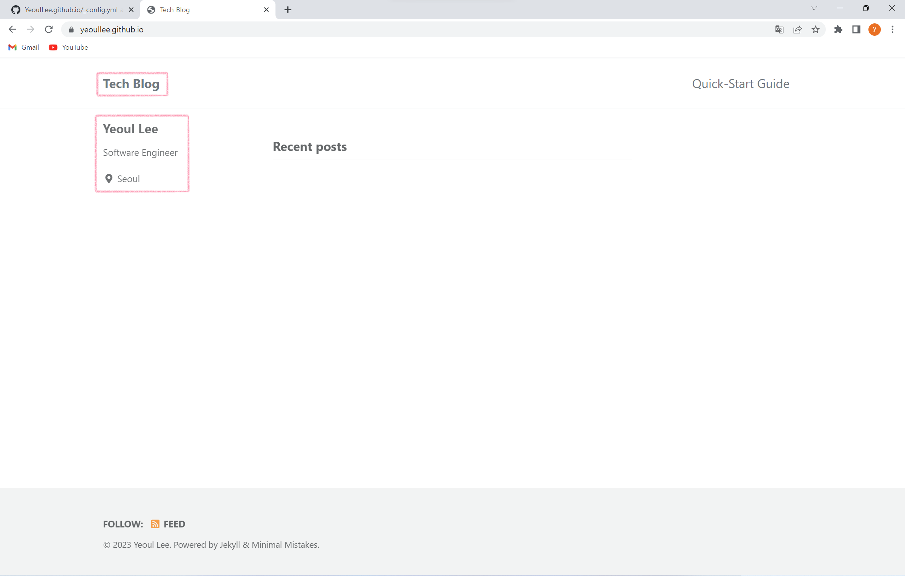

# 0. Github 계정 생성

Github 가입을 통해 계정이 있어야 한다.

# 1. Github jekyll-theme Fork

Github Blog를 쉽게 만들 수 있도록 도와주는 Jekyll Theme를 사용하였다.

다양한 Jekyll Themes 중 나의 경우 가장 Star 수가 높은
https://github.com/mmistakes/minimal-mistakes
를 Fork 받았다.

1. https://github.com/mmistakes/minimal-mistakes 로 이동
2. Fork 클릭

3. Repository name에 *ID*.github.io 입력
4. Create fork 클릭

5. YeoulLee.github.io 이름의 repository가 생성됨
 

# 3. _config.yml 수정

1. _config.yml 클릭

2. Edit this file 클릭

3. (19 line) 원하는 title로 변경
4. (24 line) url 주소 입력 (repository 명과 동일하게 입력)

5. (107 line) name 변경
6. (109 line) 간단한 소개 입력
7. (110 line) location 변경
8. Commit changes 클릭

# 4. url 접속

1. Actions 클릭
2. workflow runs가 초록색 체크 상태로 변할 때까지 대기

3. url 주소(24 line에 입력한)로 이동하면 위와 같은 blog page를 볼 수 있다.

