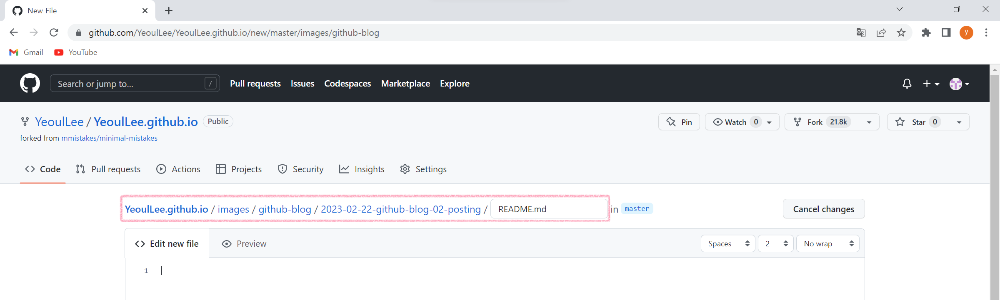
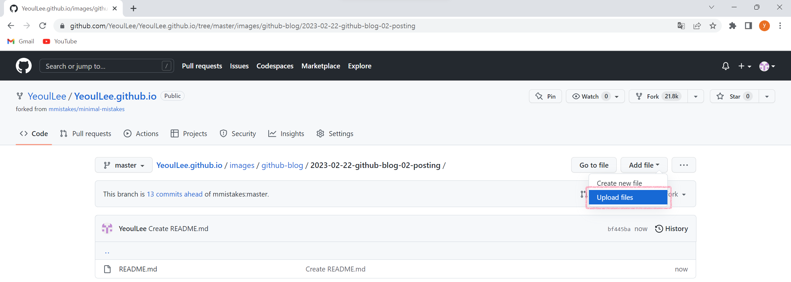
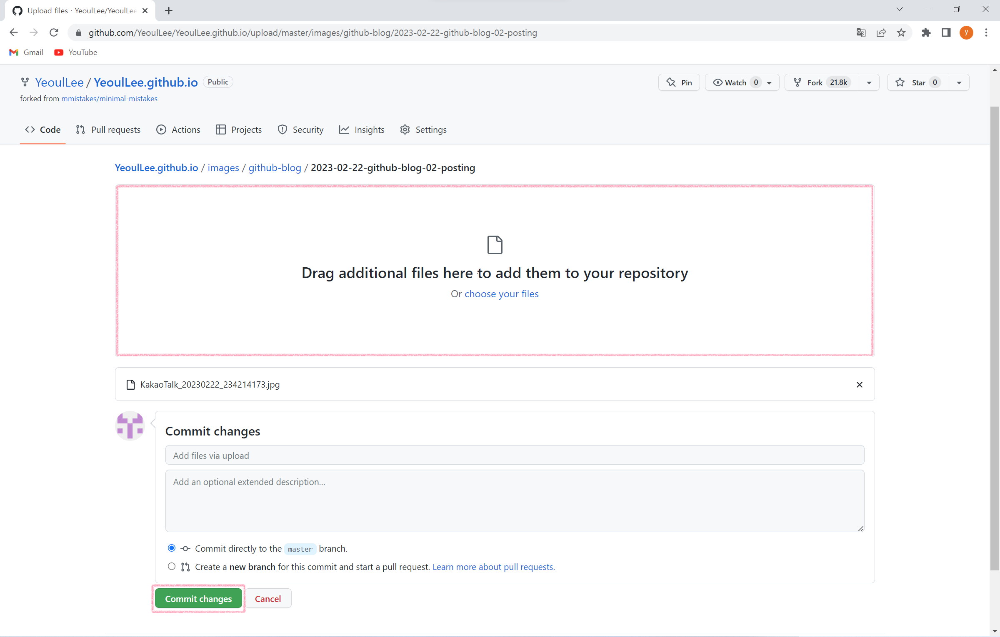
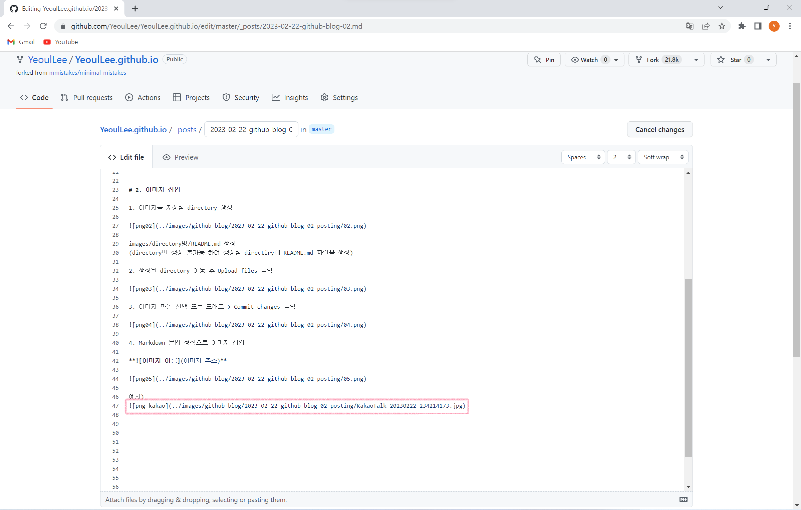

# 1. 글 쓰기

1. _post 폴더에 YYYY-MM-DD-텍스트.md로 파일 생성


2. 아래 코드로 layout, title 설정
```
---
layout: post
title: "Github Blog 만들기 02"
---
```

3. Markdown 형식으로 글쓰기


# 2. 이미지 삽입

1. 이미지를 저장할 directory 생성



images/directory명/README.md 생성
(directory만 생성 불가능 하여 생성할 directiry에 README.md 파일을 생성)

2. 생성된 directory 이동 후 Upload files 클릭



3. 이미지 파일 선택 또는 드래그 > Commit changes 클릭



4. Markdown 문법 형식으로 이미지 삽입

****



예시)


